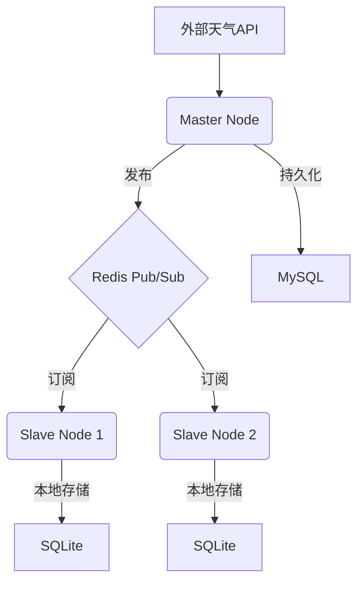
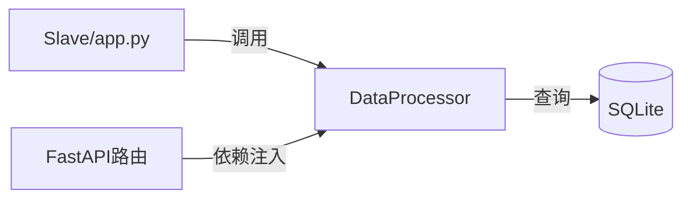
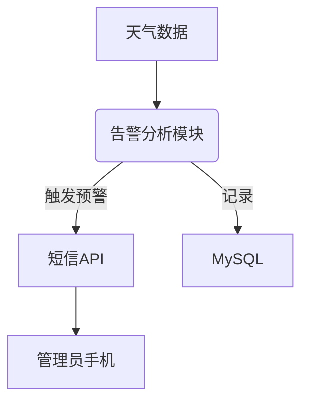

# 多机天气同步系统

## 项目简介
本项目旨在构建一个主节点获取天气数据，多个从节点实时同步的分布式系统。主节点定时采集天气信息，通过 Redis Pub/Sub 广播到各从节点，并持久化到 MySQL，支持后续数据可视化与扩展。

---

## 技术栈
- **语言**：Python 3.8+
- **框架**：FastAPI
- **中间件**：Redis Pub/Sub
- **数据库**：MySQL 8.0 (主节点), SQLite (从节点)
- **部署**：Docker + Kubernetes（后期）

---

## 系统架构图



---

## 业务逻辑流程

1. **数据获取**
   Master 节点每 60 秒调用天气 API，获取指定城市的天气数据。
   *错误处理*：API请求失败时自动重试(指数退避)，3次失败后报警。

2. **数据存储**
   Master 节点先将数据持久化到 MySQL，成功后再发布到 Redis。
   *错误处理*：数据库操作失败时记录日志并重试。

3. **数据同步**
   Master 将数据以 JSON 格式发布到 Redis 频道，所有 Slave 节点实时订阅并接收数据。
   *错误处理*：Redis断线自动重连，消息格式错误时跳过并记录。

4. **本地持久化**
   Slave 节点将接收的数据保存到本地 SQLite 数据库。
   *错误处理*：数据库操作失败记录日志，不影响主流程。

5. **可扩展性**
   支持多 Slave 节点，后续可扩展数据可视化、报警、移动端等功能。

---

## 部署步骤

1. **准备环境**
   - 安装 Python 3.8+，pip
   - 安装并启动 MySQL 8.0+，创建数据库和表（见下方 SQL 示例）
   - 安装并启动 Redis

2. **克隆项目并安装依赖**
   ```bash
   git clone <本项目地址>
   cd weather_sync
   python -m venv venv
   venv\Scripts\activate  # Windows
   # source venv/bin/activate  # Linux/Mac
   pip install -r requirements.txt
   ```

3. **配置环境变量**
   - 可在 .env 文件或系统环境变量中设置以下内容：
     ```
     WEATHER_API_KEY=你的OpenWeatherMap API Key
     WEATHER_LAT=纬度
     WEATHER_LON=经度
     MYSQL_HOST=MySQL地址
     MYSQL_PORT=3306
     MYSQL_USER=用户名
     MYSQL_PASSWORD=密码
     MYSQL_DB=weather
     REDIS_HOST=Redis地址
     REDIS_PORT=6379
     REDIS_CHANNEL=weather:updates
     SQLITE_DB=weather_slave.db
     ```

4. **初始化数据库表**
   - MySQL 执行：
     ```sql
     CREATE TABLE weather_data (
       id INT AUTO_INCREMENT PRIMARY KEY,
       city VARCHAR(50) NOT NULL,
       temperature FLOAT,
       humidity INT,
       recorded_at TIMESTAMP,
       lat FLOAT,
       lon FLOAT,
       weather VARCHAR(100)
     );
     ```
   - SQLite 会自动创建(表结构类似)：
     ```sql
     CREATE TABLE weather_data (
       id INTEGER PRIMARY KEY AUTOINCREMENT,
       city TEXT NOT NULL,
       temperature REAL,
       humidity INTEGER,
       recorded_at TEXT,
       lat REAL,
       lon REAL,
       weather TEXT
     );
     ```

5. **启动主节点**
   ```bash
   python master/app.py
   # 默认API服务监听 http://localhost:8000/api/health
   ```

6. **启动从节点**
   ```bash
   python slave/app.py
   # 默认API服务监听 http://localhost:8001/api/health
   ```

7. **查看日志与数据**
   - 控制台输出日志
   - MySQL/SQLite 可用客户端工具查看数据

---

## API 设计（预留 FastAPI 实现）

### Master Node API

| 路径                | 方法   | 描述             | 请求参数         | 返回示例/说明 |
|---------------------|--------|------------------|------------------|--------------|
| /api/health         | GET    | 健康检查         | 无               | {"status": "ok"} |
| /api/weather/latest | GET    | 获取最新天气数据 | city（可选）     | {"city": "Beijing", "temp": 26.5, "humidity": 65, "timestamp": "..."} |
| /api/weather/history| GET    | 查询历史数据     | city, start, end | [{"city": "...", ...}, ...] |
| /api/publish        | POST   | 手动发布天气数据 | JSON数据         | {"result": "success"} |

### Slave Node API（可选，便于本地展示或调试）

| 路径                | 方法   | 描述             | 请求参数         | 返回示例/说明 |
|---------------------|--------|------------------|------------------|--------------|
| /api/health         | GET    | 健康检查         | 无               | {"status": "ok"} |
| /api/weather/local  | GET    | 获取本地最新数据 | city（可选）     | {"city": "...", ...} |

> 所有接口将采用 FastAPI 实现，支持自动生成 OpenAPI 文档，便于前后端联调和后续扩展。

---

## 目录结构

```
weather_sync/
├── master/
│   ├── app.py            # 主程序（集成 FastAPI）
│   ├── weather_api.py    # 天气API调用
│   ├── mysql_writer.py   # MySQL写入
│   ├── redispub.py       # Redis发布
│   └── __pycache__/
├── slave/
│   ├── app.py            # 从节点主程序
│   ├── data_processor.py # 数据处理
│   └── __pycache__/
├── shared/
│   ├── db_connector.py   # 数据库连接(MySQL+SQLite)
│   ├── redis_util.py     # Redis工具
│   └── __pycache__/
├── .env.template         # 环境变量模板
├── requirements.txt      # 依赖
└── README.md             # 项目文档
```

---

## 开发路线图

- **基础版**：单 Master + 单 Slave，控制台日志输出
- **增强版**：多 Slave，异常处理，数据校验
- **生产版**：Docker 容器化，Kubernetes 部署

---

## Slave数据处理模块设计

### 功能概述
- 提供本地SQLite数据查询接口
- 实现基础数据统计计算
- 支持数据过滤和条件查询
- 与FastAPI路由集成

### 核心API设计
```python
class DataProcessor:
    """Slave节点本地数据处理核心类"""
    
    def get_latest(self, city: str = None) -> dict:
        """获取最新一条天气数据"""
        
    def get_history(self,
                  city: str = None,
                  start_time: str = None,
                  end_time: str = None) -> list[dict]:
        """按条件查询历史数据"""
        
    def get_stats(self,
                city: str = None,
                metric: str = "temperature") -> dict:
        """计算指定指标的统计值(avg/max/min)"""
        
    def filter_data(self,
                  conditions: dict) -> list[dict]:
        """按条件过滤数据(如温度>30)"""
```

### 架构集成


### 错误处理
- 数据库查询异常捕获并记录日志
- 无效输入参数返回400错误
- 空结果返回204状态码

### 性能考虑
- 大数据量查询使用分页
- 频繁访问指标可缓存统计结果

---

## 主节点告警模块设计

### 功能概述
- 实时监测温度变化，发布升温/降温预警
- 检测极端天气条件（暴雨/暴雪/高温等）
- 通过短信API发送预警通知
- 预警历史记录存储

### 预警规则配置
```python
# 示例配置
ALERT_RULES = {
    "temp_increase": {
        "threshold": 5,  # 24小时内升温≥5℃
        "message": "气温快速上升预警：{city}24小时内升温{delta}℃"
    },
    "temp_decrease": {
        "threshold": 5,  # 24小时内降温≥5℃
        "message": "寒潮预警：{city}24小时内降温{delta}℃"
    },
    "extreme_weather": {
        "conditions": ["暴雨", "暴雪", "高温红色"],
        "message": "极端天气预警：{city}当前天气{weather}"
    }
}
```

### 短信通知接口
```python
def send_sms_alert(phone_numbers: list, message: str):
    """调用短信API发送预警通知
    参数：
        phone_numbers: 接收人手机号列表
        message: 预警消息内容
    """
    # 预留接口，实际对接短信服务商API
```

### 架构集成


### 错误处理
- 短信发送失败自动重试
- 预警规则加载失败回退默认配置
- 所有异常记录日志并报警

---

## 关键注意事项

- **安全**：API 密钥使用环境变量，MySQL 生产环境启用 SSL
- **性能**：Redis 消息可压缩，大数据量用 MySQL 批量插入
- **可观测性**：建议使用 logging，监控消息延迟与资源占用

---

## 扩展方向

- 数据可视化（Flask/Django）
- 报警系统（邮件通知）
- 移动端适配（Android/iOS）

---

## 参考资源

- [Redis Pub/Sub 官方文档](https://redis.io/docs/manual/pubsub/)
- [Python MySQL 操作指南](https://pymysql.readthedocs.io/)
- [Docker 化 Python 应用](https://docs.docker.com/language/python/build-images/)

---

## 架构更新

- **告警模块**：
    - 包含alarm_manager.py, sms_sender.py
    - alarm_manager.py: 告警管理核心，负责检查预警规则并触发通知，预警规则配置在模块内部
    - sms_sender.py: 短信发送模块，负责调用短信API发送通知
- **大模型对话模块**：
    - 包含llm_advisor.py
    - llm_advisor.py: 调用LLM API提供穿衣建议和风险预警，从环境变量获取API Key
   
   - **Shared 库增强:**
       - `db_connector.py`: 引入 MySQL 连接池，增强连接错误处理，使用上下文管理器。
       - `redis_util.py`: 增强 Redis 连接错误处理和自动重连，支持更多配置选项，封装 `publish` 和 `subscribe` 操作。

- [Redis Pub/Sub 官方文档](https://redis.io/docs/manual/pubsub/)
- [Python MySQL 操作指南](https://pymysql.readthedocs.io/)
- [Docker 化 Python 应用](https://docs.docker.com/language/python/build-images/)

---

## 架构更新

- **告警模块**：
    - 包含alarm_manager.py, sms_sender.py
    - alarm_manager.py: 告警管理核心，负责检查预警规则并触发通知，预警规则配置在模块内部
    - sms_sender.py: 短信发送模块，负责调用短信API发送通知
- **大模型对话模块**：
    - 包含llm_advisor.py
    - llm_advisor.py: 调用LLM API提供穿衣建议和风险预警，从环境变量获取API Key

- [Redis Pub/Sub 官方文档](https://redis.io/docs/manual/pubsub/)
- [Python MySQL 操作指南](https://pymysql.readthedocs.io/)
- [Docker 化 Python 应用](https://docs.docker.com/language/python/build-images/)

---

## 架构更新

- **告警模块**：
    - 包含alarm_manager.py, sms_sender.py, config.py
    - alarm_manager.py: 告警管理核心，负责检查预警规则并触发通知
    - sms_sender.py: 短信发送模块，负责调用短信API发送通知
    - config.py: 告警模块配置信息，包括预警规则和短信API地址
- **大模型对话模块**：
    - 包含llm_advisor.py
    - llm_advisor.py: 调用LLM API提供穿衣建议和风险预警，从环境变量获取API Key

---

## 架构更新

- 主节点增加大模型对话模块，包含llm_advisor.py
- llm_advisor.py: 大模型对话模块，调用LLM API提供穿衣建议和风险预警，从环境变量获取API Key

- [Redis Pub/Sub 官方文档](https://redis.io/docs/manual/pubsub/)
- [Python MySQL 操作指南](https://pymysql.readthedocs.io/)
- [Docker 化 Python 应用](https://docs.docker.com/language/python/build-images/)

---

## 架构更新

- 主节点增加告警模块，包含alarm_manager.py, sms_sender.py, config.py
- alarm_manager.py: 告警管理核心，负责检查预警规则并触发通知
- sms_sender.py: 短信发送模块，负责调用短信API发送通知
- config.py: 告警模块配置信息，包括预警规则和短信API地址