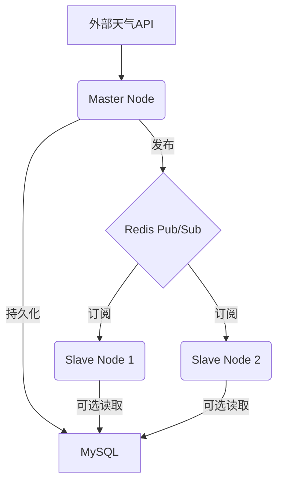

# 多机天气同步系统

## 项目简介
本项目旨在构建一个主节点获取天气数据，多个从节点实时同步的分布式系统。主节点定时采集天气信息，通过 Redis Pub/Sub 广播到各从节点，并持久化到 MySQL，支持后续数据可视化与扩展。

---

## 技术栈
- **语言**：Python 3.8+
- **中间件**：Redis Pub/Sub
- **数据库**：MySQL 8.0
- **部署**：Docker + Kubernetes（后期）

---

## 系统架构图



---

## 业务逻辑流程

1. **数据获取**  
   Master 节点每 60 秒调用天气 API，获取指定城市的天气数据。

2. **数据同步**  
   Master 将数据以 JSON 格式发布到 Redis 频道，所有 Slave 节点实时订阅并接收数据。

3. **数据存储**  
   Master 节点将数据持久化到 MySQL，Slave 节点可根据需要本地存储或展示。

4. **可扩展性**  
   支持多 Slave 节点，后续可扩展数据可视化、报警、移动端等功能。

---

## API 设计（预留 FastAPI 实现）

### Master Node API

| 路径                | 方法   | 描述             | 请求参数         | 返回示例/说明 |
|---------------------|--------|------------------|------------------|--------------|
| /api/health         | GET    | 健康检查         | 无               | {"status": "ok"} |
| /api/weather/latest | GET    | 获取最新天气数据 | city（可选）     | {"city": "Beijing", "temp": 26.5, "humidity": 65, "timestamp": "..."} |
| /api/weather/history| GET    | 查询历史数据     | city, start, end | [{"city": "...", ...}, ...] |
| /api/publish        | POST   | 手动发布天气数据 | JSON数据         | {"result": "success"} |

### Slave Node API（可选，便于本地展示或调试）

| 路径                | 方法   | 描述             | 请求参数         | 返回示例/说明 |
|---------------------|--------|------------------|------------------|--------------|
| /api/health         | GET    | 健康检查         | 无               | {"status": "ok"} |
| /api/weather/local  | GET    | 获取本地最新数据 | city（可选）     | {"city": "...", ...} |

> 所有接口将采用 FastAPI 实现，支持自动生成 OpenAPI 文档，便于前后端联调和后续扩展。

---

## 目录结构

```
weather_sync/
├── master/
│   ├── app.py            # 主程序（集成 FastAPI，暴露 RESTful API）
│   ├── config.py         # 配置
│   └── requirements.txt  # 依赖
├── slave/
│   ├── app.py            # 从节点主程序（预留 FastAPI 本地接口）
│   └── data_processor.py # 数据处理
└── shared/
    ├── db_connector.py   # 数据库连接
    └── redis_util.py     # Redis工具
```

---

## 开发路线图

- **基础版**：单 Master + 单 Slave，控制台日志输出
- **增强版**：多 Slave，异常处理，数据校验
- **生产版**：Docker 容器化，Kubernetes 部署

---

## 关键注意事项

- **安全**：API 密钥使用环境变量，MySQL 生产环境启用 SSL
- **性能**：Redis 消息可压缩，大数据量用 MySQL 批量插入
- **可观测性**：建议使用 logging，监控消息延迟与资源占用

---

## 扩展方向

- 数据可视化（Flask/Django）
- 报警系统（邮件通知）
- 移动端适配（Android/iOS）

---

## 参考资源

- [Redis Pub/Sub 官方文档](https://redis.io/docs/manual/pubsub/)
- [Python MySQL 操作指南](https://pymysql.readthedocs.io/)
- [Docker 化 Python 应用](https://docs.docker.com/language/python/build-images/)