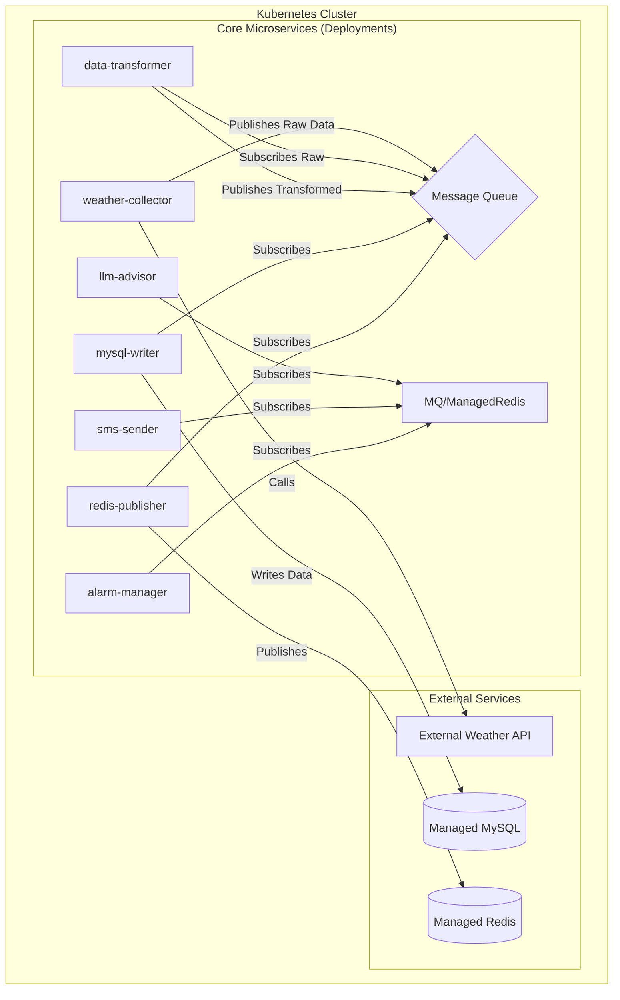

# 天气同步系统云原生重构计划

## 目标架构

## 模块职责说明

### 1. weather-collector
- 职责：定时从外部API获取原始天气数据
- 输入：外部API配置
- 输出：原始数据发布到MQ
- 技术栈：Python + FastAPI
- 关键接口：
  - `/health` 健康检查
  - `/trigger` 手动触发采集

### 2. data-transformer
- 职责：数据格式转换和处理
- 输入：MQ原始数据
- 输出：处理后的数据发布到MQ
- 处理逻辑：
  - 数据清洗
  - 单位转换
  - 字段重组

### 3. mysql-writer
- 职责：数据持久化存储
- 输入：MQ处理后的数据
- 输出：写入MySQL
- 表结构设计：
  - current_weather
  - hourly_forecast
  - daily_forecast
  - weather_alerts

### 4. redis-publisher
- 职责：实时数据广播
- 输入：MQ处理后的数据
- 输出：发布到Redis Pub/Sub
- 频道设计：
  - weather:current
  - weather:alerts
  - weather:updates

### 5. llm-advisor
- 职责：生成天气建议
- 输入：Redis/MQ数据
- 输出：建议内容
- API接口：
  - POST /advice {location, date}

### 6. sms-sender
- 职责：发送天气通知短信
- 触发条件：
  - 极端天气预警
  - 定时提醒
- 接口：
  - POST /send {phone, message}

### 7. alarm-manager
- 职责：天气警报管理
- 规则配置：
  - 温度阈值
  - 降水概率
  - 风速预警
- 动作：
  - 触发短信
  - 记录日志
  - 通知API

## 实施阶段

### 阶段一：基础准备 (1周)
1. 容器化改造
   - 编写各服务Dockerfile
   - 构建基础镜像
2. 消息队列部署
   - Redis Stream配置
   - 主题规划
3. 共享库重构
   - db_connector优化
   - redis_util增强

### 阶段二：核心服务改造 (2周)
1. weather-collector开发
2. data-transformer开发
3. mysql-writer开发
4. redis-publisher开发

### 阶段三：业务服务迁移 (1周)
1. llm-advisor重构
2. sms-sender重构
3. alarm-manager重构

### 阶段四：K8s部署 (1周)
1. 编写部署清单
   - Deployments
   - Services
   - ConfigMaps
2. 配置监控告警
   - Prometheus
   - Grafana
3. CI/CD流水线搭建

## 技术选型

| 组件         | 技术方案                |
|--------------|-------------------------|
| 消息队列     | Redis Stream            |
| 数据库       | MySQL 8.0               |
| 缓存         | Redis 7                 |
| 容器编排     | Kubernetes 1.28         |
| 监控         | Prometheus + Grafana    |
| 日志         | EFK Stack               |
| CI/CD        | GitHub Actions          |